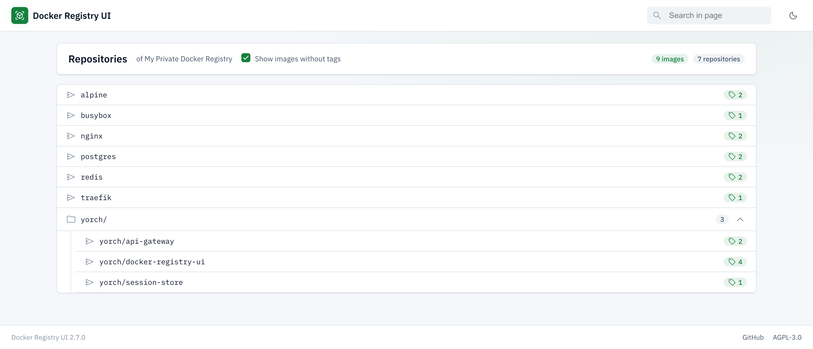

# Registry Explorer

[](https://github.com/yorch/docker-registry-ui/releases)
[](https://github.com/yorch/docker-registry-ui/stargazers)
[](https://github.com/yorch/docker-registry-ui/pkgs/container/docker-registry-ui)

> This is a fork of [Joxit/docker-registry-ui](https://github.com/Joxit/docker-registry-ui), maintained independently for my own use. It is not affiliated with or endorsed by the original author. Licensed AGPL-3.0, same as upstream.

> Issue and pull request references throughout this document (`#NN`) link to [upstream's tracker](https://github.com/Joxit/docker-registry-ui/issues), where those features and fixes originated.

## Changes from upstream

This fork is a modified version of the original project. The substantive differences:

- **Modern SaaS redesign.** A header-bar application shell, card-based data tables, and light/dark themes replace the previous Material UI look. The `riot-mui` dependency (which upstream pinned to a fork commit) is gone, replaced by a dependency-free design system under `src/styles/` (`tokens.scss`, `base.scss`, `layout.scss`, `components.scss`). See [docs/UI-UX-REVAMP.md](https://github.com/yorch/docker-registry-ui/blob/main/docs/UI-UX-REVAMP.md) for the design notes.
- **Async tag counts in the catalog.** Tag-count badges are fetched in the background and fill in as each count resolves, instead of blocking the catalog render.
- **Tag-list selection, pagination, and error fixes.** `Alt + Click` and `Shift + Click` selection work again — they read `altKey`/`shiftKey`, which a forwarded `change` event never carried, so the checkbox now forwards pointer events instead. Select-all-on-page respects the configured page size rather than falling back to a default. `getNumPages` no longer reports a phantom empty trailing page when the tag count is an exact multiple of the page size. `image-size` and `architectures` no longer leak an event listener on every re-render. A page-level error (unreachable catalog, mixed content, malformed registry URL) stays visible until the next catalog load instead of disappearing on a 1s timer.
- **Registry request caching and bounded fan-out.** Tag lists and tag-addressed manifests are now cached for 30 seconds (`MUTABLE_TTL_MS` in `src/scripts/cache-request.js`), in addition to the existing indefinite cache for digest-addressed blobs and manifests. Requests are bounded to 6 concurrent (`MAX_CONCURRENT_REQUESTS` in `src/scripts/request-pool.js`) instead of firing all at once — on a 100-tag catalog, peak concurrent requests drops from about 101 to about 7. Tag-list cells distinguish a pending fetch from a failed one instead of appearing to load forever, and the delete flow opts out of the cache, since it reads a content digest and then deletes by it.
- **Registry operations for large installations.** Catalog pages follow the Distribution API's `Link: rel="next"` continuation instead of silently stopping at the first page. Multi-platform tags expose an on-demand per-platform manifest, date, layer, size, and digest breakdown. The catalog also includes a progressive registry inventory and a preview-first retention planner; it excludes protected, recent, kept, or unverifiable aliases and only enables deletion when `DELETE_IMAGES=true`. Reported sizes come from compressed manifest layers and are estimates, not filesystem usage.
- **Images are published to GHCR**, not Docker Hub. Pull from `ghcr.io/yorch/docker-registry-ui` instead of `joxit/docker-registry-ui`.
- **Biome replaces Prettier** for formatting and linting.
- **Multi-stage Docker builds**, and `dist/` is no longer committed to the repository. The images build the bundle themselves.
- **Build platforms are narrowed to `linux/amd64` and `linux/arm64`.** Upstream additionally published `arm/v6`, `arm/v7`, `ppc64le`, `s390x` and similar; those were deliberately dropped here.

## Overview

This project aims to provide a simple and complete user interface for your private docker registry. You can customize the interface with various options. The major option is `SINGLE_REGISTRY` which allows you to disable the dynamic selection of docker registries (same behavior as the old **static** tag).

You may need the [migration guide from 1.x to 2.x](https://github.com/Joxit/docker-registry-ui/wiki/Migrating-from-1.x-to-2.x) or [the 1.x readme](https://github.com/Joxit/docker-registry-ui/blob/8fe3adf12540d1316cb57628ebe86a392a703d90/README.md) — both are upstream documentation, kept here because this fork has no local equivalent. The project support both [docker registry v2](https://github.com/distribution/distribution/releases/tag/v2.0.0) and [docker registry v3](https://github.com/distribution/distribution/releases/tag/v3.0.0).

This web user interface uses [Riot](https://github.com/Riot/riot) the react-like user interface micro-library with a custom, dependency-free design system (modern SaaS look: header-bar shell, data tables, light/dark themes).

## Supported Docker tags

Images are published to [`ghcr.io/yorch/docker-registry-ui`](https://github.com/yorch/docker-registry-ui/pkgs/container/docker-registry-ui).

* `latest`: image with the latest release of Registry Explorer based on `nginx:alpine`
* `latest-debian`: image with the latest release of Registry Explorer based on `nginx:debian`
* `main`: image with the beta version of Registry Explorer based on `nginx:alpine`
* `main-debian`: image with the beta version of Registry Explorer based on `nginx:debian`
* `3`: image with the latest release of Registry Explorer v3 (includes latest minor and patch version)
* `3.x`: image with the latest release of Registry Explorer v3.x (includes latest patch version)
* `3.x.y`: image with the specific release of Registry Explorer v3.x.y
* each of the above also has a `-debian` variant built on `nginx:debian`

```sh
docker pull ghcr.io/yorch/docker-registry-ui:latest
```

## [Project Page](https://yorch.github.io/docker-registry-ui), [Examples](https://github.com/yorch/docker-registry-ui/tree/main/examples)



## Concepts

Registry Explorer uses the same words as the [Distribution API](https://distribution.github.io/distribution/spec/api/), with one addition of its own.

| Term | What it is | Example |
| --- | --- | --- |
| **Repository** | A name you can pull. One entry in the registry's `/v2/_catalog`. | `team/service-a` |
| **Namespace** | A group of repositories sharing a leading path segment. **A display grouping only** — the registry does not store namespaces and the API never returns them. | `team/` |
| **Image** | A repository plus a tag: one thing you built and pushed. | `nginx:1.27` |
| **Tag** | A mutable label pointing at a manifest inside one repository. | `1.27` |
| **Manifest** | What a tag resolves to. Either a single-platform image or an index listing one manifest per platform. | `sha256:a1b2…` |

The catalog header counts the first two, and they are usually different numbers. Given a registry holding:

```
broken-manifest  empty  exactly-100  huge  nginx
no-digest-header  oci-index  slow  team/service-a  team/service-b
```

the header reads **10 repositories · 9 namespaces** — ten pullable names, shown as nine top-level rows, because `team/service-a` and `team/service-b` collapse under a single `team/` row.

Two things follow from that:

- The namespace count is *rows in the tree*, not the number of prefixes. Ungrouped repositories count as one row each, so a registry where nothing shares a prefix legitimately reports the same number twice.
- Grouping is presentation, not data. Set `CATALOG_MIN_BRANCHES=0` and `CATALOG_MAX_BRANCHES=0` to switch it off and get one row per repository; raise `CATALOG_MAX_BRANCHES` to nest deeper (`a/b/c` grouping under `a/b/` rather than `a/`). Nothing about the registry changes either way.

## Hidden Features

- Many ways to delete multiple images at once
  - Select multiple tags to delete with checkboxes (see [#29](https://github.com/Joxit/docker-registry-ui/issues/29) and [#79](https://github.com/Joxit/docker-registry-ui/pull/79)). Since 1.2.0
  - Select all tags of the page with `ALT + Click` on the indeterminate checkbox (see [#80](https://github.com/Joxit/docker-registry-ui/issues/80) and [#81](https://github.com/Joxit/docker-registry-ui/pull/81)). Since 1.2.1
  - Select all contigous tags between two tags with `Shift + Click` on the first tag then `Shift + Click` on the second tag (see [#287](https://github.com/Joxit/docker-registry-ui/pull/287)). Since 2.4.0
- Show sha256 for specific tag (hover image tag).
- Sort the tag list with number compatibility (see [#45](https://github.com/Joxit/docker-registry-ui/pull/45) and [#46](https://github.com/Joxit/docker-registry-ui/pull/46)). Since 0.4.0
- Share your Registry Explorer instance when you are deploying a UI with `SINGLE_REGISTRY=false`.
  - Point any deployed instance at a registry with the `url` query parameter (e.g. `https://ui.example.com?url=https://registry.example.com`). The registry must allow CORS from wherever the UI is served. This fork does not host a public instance, so unlike upstream there is no shared demo URL to use here.
  - You can use a single interface with many registry, add them in the menu in the top right of the page.
- Filter images and tags with the search bar.
  - You can select the search bar with the shortcut `CRTL + F` or `F3`. When the search bar is already focused, the shortcut will fallback to the default behavior (see [#213](https://github.com/Joxit/docker-registry-ui/issues/213)). Since 2.1.0
- Multi arch support in history page (see [#130](https://github.com/Joxit/docker-registry-ui/issues/130) and [#134](https://github.com/Joxit/docker-registry-ui/pull/134)). Since 1.5.0
- Show the content of the dockerfile (see [#286](https://github.com/Joxit/docker-registry-ui/pull/286)). Since 2.4.0
- The UI will cache requests from your registry: blobs and manifests addressed by digest (URL with `sha256:`) are cached indefinitely, and tag lists and tag-addressed manifests are cached for 30 seconds. The delete flow always bypasses the cache, since it reads `Docker-Content-Digest` from a tag-addressed manifest and then deletes by that digest — a stale hit there would delete the wrong manifest.

Checkout all options in [Available options](#available-options) section.

## FAQ

-   What is the difference between **`SINGLE_REGISTRY=false`** and **`SINGLE_REGISTRY=true`** options ?
    -   When `SINGLE_REGISTRY` is set to false, a menu appears on the interface allowing you to dynamically change docker registry URLs.
-   Why, when I delete all tags of an image, the image is still in the UI ?
    -   This is a limitation of docker registry, the garbage collector don't remove empty images. If you want to delete dangling images, you will need to delete the folder in your registry data. (see [#77](https://github.com/Joxit/docker-registry-ui/issues/77))
-   Why the image size in the UI is not the same as displayed during `docker images` ?
    -   The UI displays the compressed size of the image and not the extracted size version.
-   Can I use HTTPS on the UI ?
    -   Yes, put your favourite reverse proxy on the front of the UI. Your reverse proxy will take care of HTTPS connection.
-   Does the UI support authentication ?
    -   Yes, but it supports only basic auth. It's a simple standalone frontend, it will use your browser window for authentication.
-   Can I use the UI and docker client with an insecure registry (registry url without https) ?
    -   Yes you can, you must first configure your docker client. (see [#76](https://github.com/Joxit/docker-registry-ui/issues/76))
-   What does Mixed Content error mean ?
    -   This means you are using a UI with HTTPS and your registry is using HTTP (unsecured). When you are on a HTTPS site, you can't get HTTP content. Upgrade you registry with a HTTPS connection.
-   Why the default nginx `Host` is set to `$http_host` ?
    -   This fixes the issue [#88](https://github.com/Joxit/docker-registry-ui/issues/88). More about this in [#113](https://github.com/Joxit/docker-registry-ui/issues/113).
-   Why OPTIONS (aka preflight requests) and DELETE fails with 401 status code (using Basic Auth) or why the UI says to check my `Access-Control-Allow-Origin` ?
    -   This is caused by a bug in docker registry, it returns 401 status requests on preflight requests, this breaks [W3C preflight-request specification](https://www.w3.org/TR/cors/#preflight-request). The docker registry maintainers have stated this will never be fixed ([distribution/distribution#4458](https://github.com/distribution/distribution/issues/4458)). It is suggested to have your UI on the same domain than your registry e.g. registry.example.com/ui/ **or** use `NGINX_PROXY_PASS_URL` **or** configure a nginx/apache/haproxy in front of your registry that returns 200 on each OPTIONS requests. (see [#104](https://github.com/Joxit/docker-registry-ui/issues/104), [#204](https://github.com/Joxit/docker-registry-ui/issues/204), [#207](https://github.com/Joxit/docker-registry-ui/issues/207), [#214](https://github.com/Joxit/docker-registry-ui/issues/214), [#266](https://github.com/Joxit/docker-registry-ui/issues/266), [#278](https://github.com/Joxit/docker-registry-ui/issues/278)).
-   Can I use Registry Explorer as a standalone application (with Electron) ?
    -   Yes, check out the example [here](https://github.com/yorch/docker-registry-ui/tree/main/examples/electron). (see [#129](https://github.com/Joxit/docker-registry-ui/pull/129))
-   I deleted images through the UI, but they are still present on the server. How can I delete them?
    - When you delete an image with the UI, only the reference is deleted and not the content. To remove dangling images, you need to run the garbage collector of the registry with the command `registry garbage-collect config.yml` or `docker exec registry registry garbage-collect config.yml`. (see [#77](https://github.com/Joxit/docker-registry-ui/issues/77), [#147](https://github.com/Joxit/docker-registry-ui/issues/147))
-   Why when I delete one tag, all tags with the same SHA are deleted ?
    - This a docker registry API limitation, there is only one way to [delete images with tag](https://docs.docker.com/registry/spec/api/#deleting-an-image), it's by its `name` and its `manifest` (it's a sha of the content). So when you delete a tag, this will delete all tags of this image with the same SHA/manifest.
-   Can I run the container with an unprivileged user ?
    - Yes you can run the container with the `nginx` user with the option `--user nginx`, this will also update the listen port to `8080` (see [#224](https://github.com/Joxit/docker-registry-ui/issues/224) and [#234](https://github.com/Joxit/docker-registry-ui/pull/234)).
-   Can I use the UI with a docker hub mirror and show `library/*` images ?
    - Yes but it is at your own risk using two regstry servers, check the comment [#155](https://github.com/Joxit/docker-registry-ui/issues/155#issuecomment-1286052124).
-   How to fix CORS issue on s3 bucket ?
    - You should add a CORS Policy on your bucket, check the issue [#193](https://github.com/Joxit/docker-registry-ui/issues/193).
-   Why my docker registry server is returning an error `pagination number invalid` ?
    - Since docker registry server 2.8.2 there is default limit of 1000 images in catalog. If you need more images update the configuration `REGISTRY_CATALOG_MAXENTRIES` with your max value and check the issue [#306](https://github.com/Joxit/docker-registry-ui/issues/306).
-   I'm using `NGINX_PROXY_PASS_URL`, my registry server has been recreated and the UI cannot connect with the message `[error] 176#176: *2 connect() failed (111: Connection refused) while connecting to upstream`, what can I do?
    - Nginx get the IP of all addresses only once at runtime, since your container has been recreated, its IP changed too. To prevent this kind of issue, you may use the option `NGINX_RESOLVER` and set to `127.0.0.11`.

Need more informations ? Try the [examples](https://github.com/yorch/docker-registry-ui/tree/main/examples) or open an issue.

## Available options

You can run the container with the unprivileged user `nginx`, see the discussion [#224](https://github.com/Joxit/docker-registry-ui/issues/224).

Some env options are available for use this interface for **only one server** (when `SINGLE_REGISTRY=true`).

- `REGISTRY_URL`: The default url of your docker registry. You **may need CORS configuration** on your registry. This is usually the domain name or IP of your registry reachable by your computer (e.g `http://registry.example.com`). (default: derived from the hostname of your UI).
- `REGISTRY_TITLE`: A human-readable name for **the registry**, shown in the header next to the status dot instead of its hostname. Distinct from `APP_NAME`, which names the application itself. Only applies while the interface stays on the registry it started with: with `SINGLE_REGISTRY=false`, switching to another registry from the menu shows that registry's host, since one fixed title cannot describe whichever registry you picked. (default: value derived from `REGISTRY_URL`) (see [#28](https://github.com/Joxit/docker-registry-ui/issues/28) and [#32](https://github.com/Joxit/docker-registry-ui/issues/32)). Since 0.3.4
- `PULL_URL`: Set a custom url when you copy the `docker pull` command (see [#71](https://github.com/Joxit/docker-registry-ui/issues/71)). (default: value derived from `REGISTRY_URL`). Since 1.1.0
- `DELETE_IMAGES`: Set if we can delete images from the UI. (default: `false`)
- `SHOW_CONTENT_DIGEST`: Show/Hide content digest in docker tag list (see [#126](https://github.com/Joxit/docker-registry-ui/issues/126) and [#131](https://github.com/Joxit/docker-registry-ui/pull/131)). (default: `false`). Since 1.4.9
- `CATALOG_ELEMENTS_LIMIT`: Number of repositories requested per catalog page. When the registry advertises a continuation link, the UI offers **Load More** and **Load All** instead of silently truncating the catalog. (default: `1000`). Since 1.4.9
- `SINGLE_REGISTRY`: Remove the menu that show the dialogs to add, remove and change the endpoint of your docker registry. (default: `false`). Since 2.0.0
- `NGINX_PROXY_PASS_URL`: Update the default Nginx configuration and set the **proxy_pass** to your backend docker registry (this avoid CORS configuration). This is usually the name of your registry container in the form `http://registry:5000`. Since 2.0.0
- `NGINX_PROXY_HEADER_*`: Update the default Nginx configuration and **set custom headers** for your backend docker registry via environment variable and file (`/etc/nginx/.env`). Only when `NGINX_PROXY_PASS_URL` is used (see [#89](https://github.com/Joxit/docker-registry-ui/pull/89)). Since 1.2.3
- `NGINX_PROXY_PASS_HEADER_*`: Update the default Nginx configuration and **forward custom headers** to your backend docker registry via environment variable and file (`/etc/nginx/.env`). Only when `NGINX_PROXY_PASS_URL` is used (see [#206](https://github.com/Joxit/docker-registry-ui/issues/206)). Since 2.1.0
- `NGINX_LISTEN_PORT`: Listen on a port other than 80, you can also change the default user and set to nginx `--user nginx` (see [#224](https://github.com/Joxit/docker-registry-ui/issues/224) and [#234](https://github.com/Joxit/docker-registry-ui/pull/234)). (default: `80` when the user is root, `8080` otherwise). Since 2.2.0
- `NGINX_RESOLVER`: Add [`resolver`](http://nginx.org/en/docs/http/ngx_http_core_module.html#resolver) directive to the nginx configuration for dynamic dns resolving. The value when you are using a docker network is `127.0.0.11`, you can set a custom DNS server too with a valid time. This is not needed when you are using kubernetes. (see [#333](https://github.com/Joxit/docker-registry-ui/issues/333) and [#339](https://github.com/Joxit/docker-registry-ui/issues/339)). (default: ``). Since 2.5.5
- `DEFAULT_REGISTRIES`: List of comma separated registry URLs (e.g `http://registry.example.com,http://registry:5000`), available only when `SINGLE_REGISTRY=false` (see [#219](https://github.com/Joxit/docker-registry-ui/pull/219)). (default: ` `). Since 2.1.0
- `READ_ONLY_REGISTRIES`: Deactivate dialog for remove and add new registries, available only when `SINGLE_REGISTRY=false` (see [#219](https://github.com/Joxit/docker-registry-ui/pull/219)). (default: `false`). Since 2.1.0
- `SHOW_CATALOG_NB_TAGS`: Show number of tags per image on the catalog page. Tag counts are fetched in the background and the badges fill in as each count loads. Set to `false` on very large registries to skip the extra tag-count requests and hide the badges (see [#161](https://github.com/Joxit/docker-registry-ui/issues/161) and [#239](https://github.com/Joxit/docker-registry-ui/pull/239)). (default: `true`). Since 2.2.0
- `HISTORY_CUSTOM_LABELS`: Expose custom labels in history page, custom labels will be processed like maintainer label (see [#160](https://github.com/Joxit/docker-registry-ui/issues/160) and [#240](https://github.com/Joxit/docker-registry-ui/pull/240)). Since 2.2.0
- `USE_CONTROL_CACHE_HEADER`: Use `Control-Cache` header and set to `no-store, no-cache`. This will avoid some issues on multi-arch images (see [#260](https://github.com/Joxit/docker-registry-ui/issues/260) and [#265](https://github.com/Joxit/docker-registry-ui/pull/265)). This option requires registry configuration: `Access-Control-Allow-Headers` with `Cache-Control`. (default: `false`). Since 2.3.0
- `THEME`: Chose your default theme, could be `dark`, `light` or `auto` (see [#283](https://github.com/Joxit/docker-registry-ui/pull/283)). When auto is selected, you will have a switch to manually change from light to dark and vice-versa (see [#291](https://github.com/Joxit/docker-registry-ui/pull/291)). (default: `auto`). Since 2.4.0
- `THEME_*`: See table in [Theme options](#theme-options) section (see [#283](https://github.com/Joxit/docker-registry-ui/pull/283)). Since 2.4.0
- `TAGLIST_ORDER`: Set the default order for the taglist page, could be `num-asc;alpha-asc`, `num-desc;alpha-asc`, `num-asc;alpha-desc`, `num-desc;alpha-desc`, `alpha-asc;num-asc`, `alpha-asc;num-desc`, `alpha-desc;num-asc` or `alpha-desc;num-desc` (see [#307](https://github.com/Joxit/docker-registry-ui/pull/307)). (default: `alpha-asc;num-desc`). Since 2.5.0
- `CATALOG_DEFAULT_EXPANDED`: Expand by default all repositories in catalog (see [#302](https://github.com/Joxit/docker-registry-ui/issues/302)). (default: `false`). Since 2.5.0
- `CATALOG_MIN_BRANCHES`: Set the minimum namespace depth to expand (e.g. in `yorch/docker-registry-ui`, `yorch/` is the namespace and the whole string is the repository). Branching can be disabled if min and max are set to 0. (see [#319](https://github.com/Joxit/docker-registry-ui/pull/319)). (default: `1`). Since 2.5.0
- `CATALOG_MAX_BRANCHES`: Set the maximum namespace depth to expand (e.g. in `yorch/docker-registry-ui`, `yorch/` is the namespace and the whole string is the repository). Branching can be disabled if min and max are set to 0. (see [#319](https://github.com/Joxit/docker-registry-ui/pull/319)). (default: `1`). Since 2.5.0
- `TAGLIST_PAGE_SIZE`: Set the number of tags to display in one page. (default: `100`). Since 2.5.0
- `REGISTRY_SECURED`: By default, the UI will check on every requests if your registry is secured or not (you will see `401` responses in your console). Set to `true` if your registry uses Basic Authentication and divide by two the number of call to your registry. (default `false`). Since 2.5.0
- `SHOW_TAG_HISTORY`: Whether to show the tag history feature or not. Allows to simplify the user interface by hiding it form the tag list if set to `false`. (default: `true`).
There are some examples with [docker-compose](https://docs.docker.com/compose/) and docker-registry-ui as proxy [here](https://github.com/yorch/docker-registry-ui/tree/main/examples/ui-as-proxy/) or docker-registry-ui as standalone [here](https://github.com/yorch/docker-registry-ui/tree/main/examples/ui-as-standalone/).
- `APP_NAME`: A custom name for **the application**, shown in the header bar. Distinct from `REGISTRY_TITLE`, which names the registry you are browsing. (default: `Registry Explorer`). Since 3.2.0
- `DOCKER_REGISTRY_UI_TITLE`: **Deprecated, use `APP_NAME`.** Still honoured so that upgrading does not silently reset a customised header, and ignored when `APP_NAME` is also set. Scheduled for removal in 4.0.0.
- `ENABLE_VERSION_NOTIFICATION`: Display notification when a new version of Registry Explorer is available. This is a weekly check. (default: `true`).

### Theme options

The default palettes follow a modern SaaS look (neutral surfaces + green accent). The `THEME_*` variables override the corresponding design token; defaults come from `src/styles/tokens.scss`.

| Environment variable | design token | light theme value | dark theme value |
| --- | --- | --- | --- |
| `THEME_PRIMARY_TEXT` | `--text-primary` | `#0f172a` | `#e6edf6` |
| `THEME_NEUTRAL_TEXT` | `--text-secondary` | `#475569` | `#9fb2c8` |
| `THEME_BACKGROUND` | `--surface` | `#ffffff` | `#111a2c` |
| `THEME_HOVER_BACKGROUND` | `--surface-hover` | `#eaf0f4` | `#1d2b44` |
| `THEME_ACCENT_TEXT` | `--accent` | `#15803d` | `#22c55e` |
| `THEME_HEADER_TEXT` | `--header-text` | `#0f172a` | `#e6edf6` |
| `THEME_HEADER_ACCENT_TEXT` | `--header-accent-text` | `#475569` | `#9fb2c8` |
| `THEME_HEADER_BACKGROUND` | `--header-background` | `#ffffff` | `#111a2c` |
| `THEME_FOOTER_TEXT` | `--footer-text` | `#475569` | `#9fb2c8` |
| `THEME_FOOTER_NEUTRAL_TEXT` | `--footer-neutral-text` | `#8b96a5` | `#667b99` |
| `THEME_FOOTER_BACKGROUND` | `--footer-background` | `#ffffff` | `#111a2c` |

## Recommended Docker Registry Usage

Here is a simple usage of Registry Explorer with Docker Registry Server using docker-compose. This example should work for most of your use case and your UI will be on the same domain as you registry.

```yml
version: '3.8'

services:
  registry-ui:
    image: ghcr.io/yorch/docker-registry-ui:main
    restart: always
    ports:
      - 80:80
    environment:
      - SINGLE_REGISTRY=true
      - REGISTRY_TITLE=My Private Registry
      - DELETE_IMAGES=true
      - SHOW_CONTENT_DIGEST=true
      - NGINX_PROXY_PASS_URL=http://registry-server:5000
      - SHOW_CATALOG_NB_TAGS=true
      - CATALOG_MIN_BRANCHES=1
      - CATALOG_MAX_BRANCHES=1
      - TAGLIST_PAGE_SIZE=100
      - REGISTRY_SECURED=false
      - CATALOG_ELEMENTS_LIMIT=1000
    container_name: registry-ui

  registry-server:
    image: registry:2.8.2
    restart: always
    environment:
      REGISTRY_HTTP_HEADERS_Access-Control-Allow-Origin: '[http://registry-ui.example.com]'
      REGISTRY_HTTP_HEADERS_Access-Control-Allow-Methods: '[HEAD,GET,OPTIONS,DELETE]'
      REGISTRY_HTTP_HEADERS_Access-Control-Allow-Credentials: '[true]'
      REGISTRY_HTTP_HEADERS_Access-Control-Allow-Headers: '[Authorization,Accept,Cache-Control]'
      REGISTRY_HTTP_HEADERS_Access-Control-Expose-Headers: '[Docker-Content-Digest,Link]'
      REGISTRY_STORAGE_DELETE_ENABLED: 'true'
    volumes:
      - ./registry/data:/var/lib/registry
    container_name: registry-server
```

## Using CORS

:warning: Before posting issues about CORS, please read the and all created issues.

:warning: If you **are using credentials** and your registry is on a different host than your UI, please read the [FAQ about OPTIONS](#faq), all the linked issues and [distribution/distribution#4458](https://github.com/distribution/distribution/issues/4458) first. The best way for the UI to work is using `NGINX_PROXY_PASS_URL` or configure your own proxy (nginx, haproxy...) that will be on top of your **docker registry** (and not the UI!) to override OPTIONS requests.

If your docker registry **does not need credentials**, you will need to send this HEADER:

```yml
http:
  headers:
    Access-Control-Allow-Origin: ['*']
    Access-Control-Allow-Headers: ['Accept', 'Cache-Control']
    Access-Control-Allow-Methods: ['HEAD', 'GET', 'OPTIONS'] # Optional
    Access-Control-Expose-Headers: ['Docker-Content-Digest', 'Link']
```

If your docker registry need credentials, you will need to send these HEADERS (you must add the protocol `http`/`https` and the port when not default `80`/`443`):

```yml
http:
  headers:
    Access-Control-Allow-Origin: ['http://registry-ui.example.com']
    Access-Control-Allow-Credentials: [true]
    Access-Control-Allow-Headers: ['Authorization', 'Accept', 'Cache-Control']
    Access-Control-Allow-Methods: ['HEAD', 'GET', 'OPTIONS'] # Optional
```

An alternative for CORS issues is a plugin on your browser, more info [here](https://github.com/Joxit/docker-registry-ui/issues/25#issuecomment-621104846) (thank you [xmontero](https://github.com/xmontero)).

## Using delete

For deleting images, you need to activate the delete feature in the UI with `DELETE_IMAGES=true` and in your registry:

```yml
storage:
    delete:
      enabled: true
```

And you need to add these HEADERS:

```yml
http:
  headers:
    Access-Control-Allow-Methods: ['HEAD', 'GET', 'OPTIONS', 'DELETE']
    Access-Control-Allow-Headers: ['Authorization', 'Accept', 'Cache-Control']
    Access-Control-Expose-Headers: ['Docker-Content-Digest', 'Link']
```

## Registry example

Example of docker registry configuration file:

```yml
version: 0.1
log:
  fields:
    service: registry
storage:
  delete:
    enabled: true
  cache:
    blobdescriptor: inmemory
  filesystem:
    rootdirectory: /var/lib/registry
http:
  addr: :5000
  headers:
    X-Content-Type-Options: [nosniff]
    Access-Control-Allow-Origin: ['http://127.0.0.1:8000']
    Access-Control-Allow-Methods: ['HEAD', 'GET', 'OPTIONS', 'DELETE']
    Access-Control-Allow-Headers: ['Authorization', 'Accept', 'Cache-Control']
    Access-Control-Max-Age: [1728000]
    Access-Control-Allow-Credentials: [true]
    Access-Control-Expose-Headers: ['Docker-Content-Digest', 'Link']
auth:
  htpasswd:
    realm: basic-realm
    path: /etc/docker/registry/htpasswd
```

## Standalone Application

If you do not want to install the docker-registry-ui on your server, you may
check out the [Electron](https://github.com/yorch/docker-registry-ui/blob/main/examples/electron/README.md) standalone application (not updated).

## All examples

- [Use docker-registry-ui as a proxy (use REGISTRY_URL)](https://github.com/yorch/docker-registry-ui/tree/main/examples/ui-as-proxy)
- [Use docker-registry-ui as standalone (use URL)](https://github.com/yorch/docker-registry-ui/tree/main/examples/ui-as-standalone)
- [Use docker-registry-ui with traefik](https://github.com/yorch/docker-registry-ui/tree/main/examples/traefik)
- [Add custom headers bases on environment variable and/or file when the ui is used as proxy](https://github.com/yorch/docker-registry-ui/tree/main/examples/proxy-headers) ([#89](https://github.com/Joxit/docker-registry-ui/pull/89))
- [Electron-based Standalone Application](https://github.com/yorch/docker-registry-ui/tree/main/examples/electron) ([#129](https://github.com/Joxit/docker-registry-ui/pull/129))
- [Use docker-registry-ui as proxy with read-only right](https://github.com/yorch/docker-registry-ui/tree/main/examples/read-only-auth) ([#47](https://github.com/Joxit/docker-registry-ui/issues/47))
- [Use docker-registry-ui on Kubernetes](https://github.com/yorch/docker-registry-ui/tree/main/examples/kubernetes)
- [Use docker-registry-ui with token authentication via Keycloak](https://github.com/yorch/docker-registry-ui/tree/main/examples/token-auth-keycloak)
- [Populate a local registry with test data](https://github.com/yorch/docker-registry-ui/tree/main/examples/populate-registry)

## Development

See [CLAUDE.md](https://github.com/yorch/docker-registry-ui/blob/main/CLAUDE.md) for build, test, and formatting commands, and
[CONTRIBUTING.md](https://github.com/yorch/docker-registry-ui/blob/main/CONTRIBUTING.md) before opening an issue or pull request.

## License

AGPL-3.0. See [LICENSE](./LICENSE).
